# 3 Container `LayoutElement` objects


<div style="page-break-before: always;"></div>

Now that you have a firm grasp on the basic `LayoutElement` objects, you can start combining them in lists and tables.

Tables especially are almost omnipresent in a corporate setting, so it pays to know the ins and outs of working with `Table` in `borb`.

In this section you'll learn:

- How to aggregate the `LayoutElement` instances you've already seen into bigger groups using `List` and `Table`
- When to use the different implementations of `List`; `OrderedList`, `RomanNumeralOrderedList` and `UnorderedList`
- When to use the different implementations of `Table`; `FlexibleColumnWidthTable` and `FixedColumnWidthTable`
- How to use the convenience methods on `Table` and `List` to set properties on all the `LayoutElement` objects they contain

There are quite a few deep-dive examples that make use of `Table` if you're up for the challenge afterwards.

- Creating a realistic invoice
- Creating a Sudoku puzzle
- Creating a tents-and-trees puzzle
- Creating a nonogram

<div style="page-break-before: always;"></div>

## 3.1 Lists

`List` is the abstract base class that performs the layout of anything resembling a sequence of `LayoutElement` objects.

Different sub-classes of `List` can refine this behavior, for instance by adding bullets or numbers in front of each list-item.

### 3.1.1 Working with `OrderedList`

In this first list-related example, you'll be creating a list with 3 items. The list will be numbered.

```python 
#!src/snippet_001.py
```


Of course, objects inside a `List` don't all need to look the same.
Try out the next example, where each item in the `List` has a different color.

```python 
#!src/snippet_002.py
```

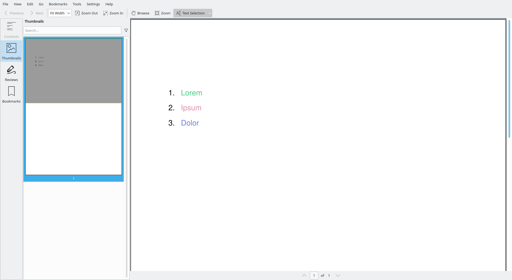

In fact, the items in  a `List` don't even need to be of the same type.
In the next example you'll create a list containing a `Paragraph`, an `Image` and an `Emoji`.

```python 
#!src/snippet_003.py
```

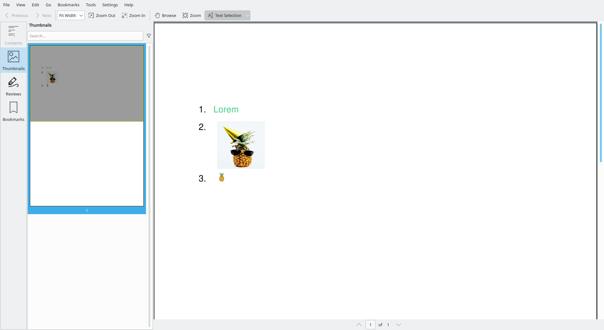

### 3.1.2 Working with `RomanNumeralOrderedList`

`borb` also supports lists with roman numerals. It works exactly the same as the regular `OrderedList`. 
In the next example you'll be creating a simple `Document` featuring a `RomanNumeralOrderedList`:

```python 
#!src/snippet_004.py
```


### 3.1.3 Working with `UnorderedList`

`UnorderedList` works exactly like `OrderedList`, the key difference being that in stead of displaying numbers before each list item, bullet-characters are displayed.

```python 
#!src/snippet_005.py
```

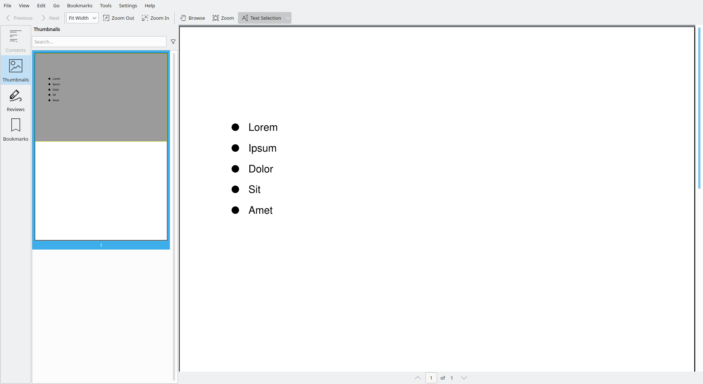

### 3.1.4 Nesting `List` objects

Of course, sometimes you'd like to display a `List` of `Lists`. 
As you already know, the content of a `List` can be just about anything. 
So naturally, `borb` supports nested Lists.

In the next example you'll be creating a nested unordered list.

```python
#!src/snippet_006.py
```


And now, you may understand why the font Zapfdingbats is required to be embedded. All those wonderful list-bullets are actually characters from the Zapfdingbats font.

Of course, you can do the same for ordered lists as well.

```python
#!src/snippet_007.py
```


Finally, you can also mix and match, embedding ordered lists into unordered lists or vice-versa.
I'll leave that as an exercise :wink:

<div style="page-break-before: always;"></div>

## 3.2 Tables

Tables offer another opportunity to present data in a format that is easily processed by the reader of your PDF's. 
You can create tables to represent invoices, itemized bills, forms, Sudoku's and much more.

`borb` offers two main implementations of the base class `Table`:

- `FixedColumnWidthTable`: In this `Table` all columns have a fixed width, which is (by default) an equal part of whatever container the `Table` occupies. E.g. if the `Table` is placed directly on the `Page`, and there are 3 columns, each column will have  1/3 of the width of the `Page` . These ratios can be tweaked of course.
- `FlexibleColumnWidthTable`: In this kind of `Table` the width of a column depends on the content the column contains. Unless physically impossible, every column gets at least its minimum width (which requires calculating the minimum width for all content items in all columns). Typically, any remaining space is divided evenly among the columns. This `Table` implementation is a bit more complex to understand, but yields a layout that resembles the classical HTML layout more closely.

Each `Table` supports:

- Setting `row_span` and `col_span` on each `TableCell`
- Setting `border_top`, `border_right`, `border_bottom` and `border_left` on each `TableCell`
- Setting `background_color` on each `TableCell`
- Setting odd/even row-colors
- Convenience methods for setting:
    - All outside borders
    - All inside borders
    - `padding_top`, `padding_right`, `padding_bottom` and `padding_left` on all `TableCell` objects in the `Table`
    - Etc

### 3.2.1 FixedColumnWidthTable

In the next example, you'll be creating a simple `FixedColumnWidthTable` with 3 columns and 2 rows.

```python
#!src/snippet_008.py
```

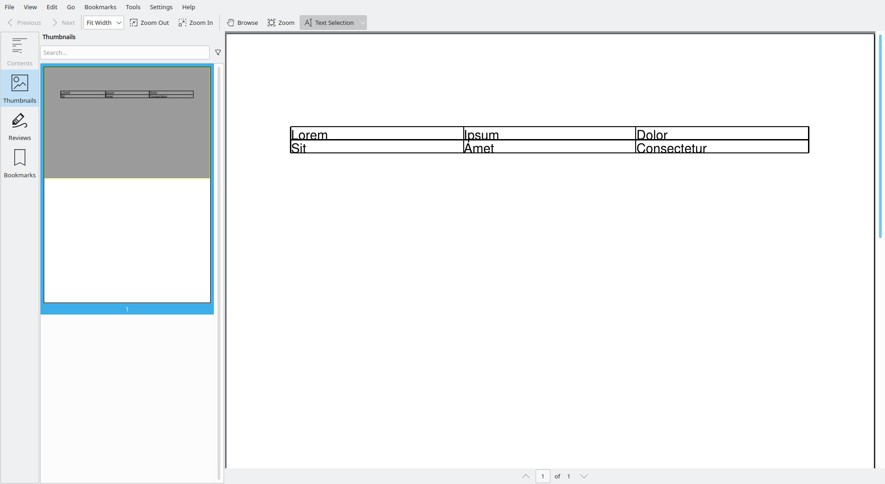

This is not exactly the best looking table in the world. 
Let's add some padding to all cells to ensure the text doesn't *stick* to the cell borders so much.

```python
#!src/snippet_009.py
```


That's a lot better already. 

As mentioned earlier, the precise ratio of the `page_width` that each column occupies is something you can configure. 
In the next example you'll be setting one column to take up 50% of the `page_width`, 
and divide the remaining space among the other 2.

```python
#!src/snippet_010.py
```

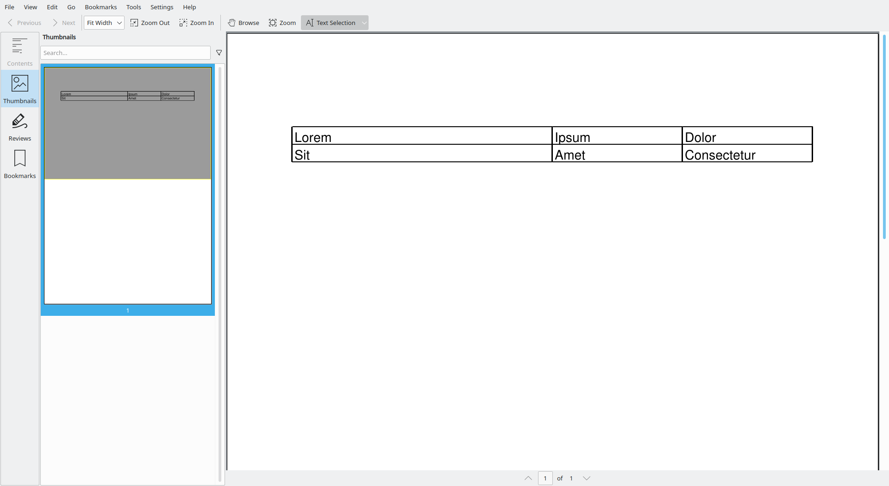

There are some other minor tweaks you can apply. 
To really visualize the next tweak, we should add some more data.

```python
#!src/snippet_011.py
```

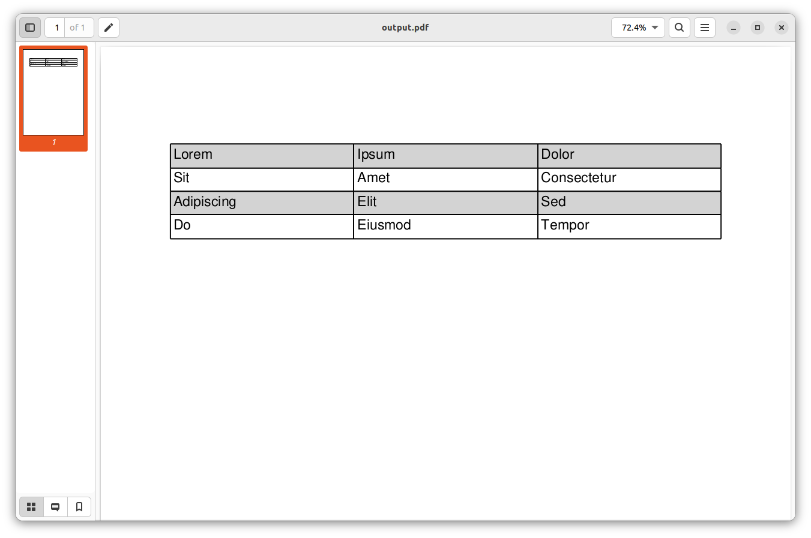

### 3.2.2 FlexibleColumnWidthTable

In the next example you're going to create a `FlexibleColumnWidthTable` similar to the ones you created earlier. 
The difference between both kinds of `Table` will become obvious.

```python
#!src/snippet_012.py
```


Let's set the padding. That'll make this `Table` look a bit better.

```python
#!src/snippet_013.py
```

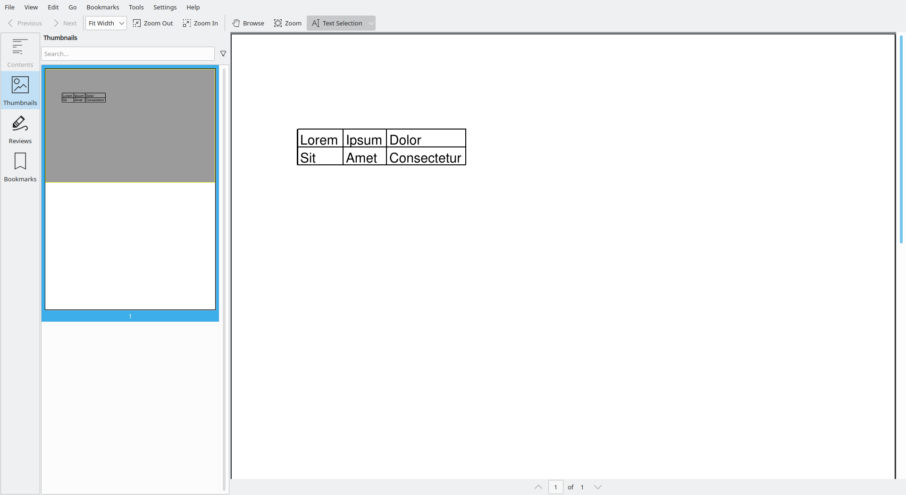

As you can see, this `Table` only takes up as much space as is needed to render the content in each `TableCell`.
This is more in line with the behavior you'd expect from an `HTML` `<table>` element.

### 3.2.3 Setting layout properties on individual cells of a `Table`

In the previous examples you've already set some layout properties. You've set padding and applied alternating background colors. Of course, there are use-cases where you'd like to set these properties on individual cell objects. 

In order to do that, you'll need to construct a `TableCell` object and apply the style there. This may feel like a bit of a workaround, but you've already been using this object without knowing it.

Every time you've added anything to a `Table` that isn't `TableCell` it was automatically getting wrapped in a `TableCell` object.

In the next example, you'll be setting the background color of an individual cell to `X11Color('Red')` and removing two of its borders.

```python
#!src/snippet_014.py
```

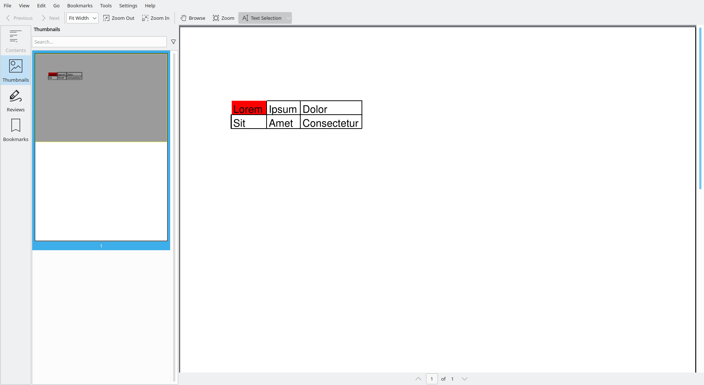

This is particularly useful when you're building a comparison matrix, and you'd like to *remove* the `TableCell` at the top-left corner.

In the next example you'll build a feature-comparison matrix for several mobile tourist guides;

```python
#!src/snippet_015.py
```

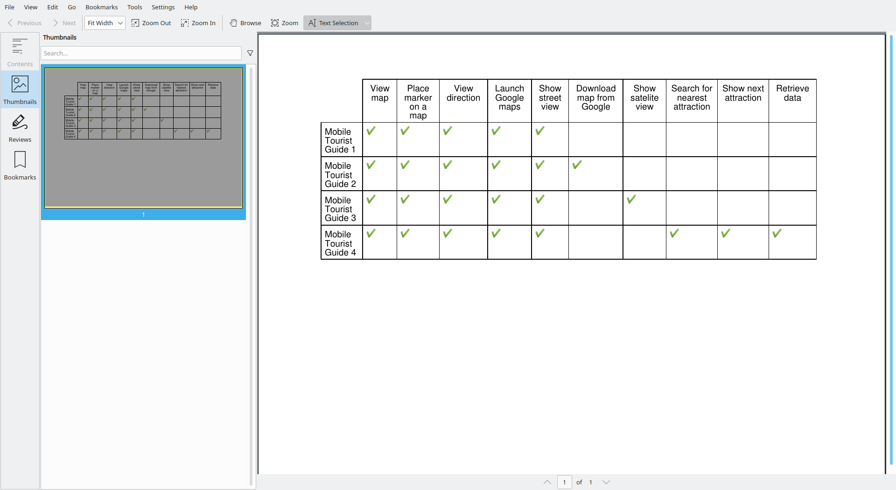

### 3.2.4 Incomplete `Table`

`Table` requires you to specify the number of rows and columns up front. Sometimes however, the amount of data does not really match `rows x columns`, and the final few cells of your `Table` are not needed.

In order to avoid having to pass empty `TableCell` or `Paragraph` objects, you can rely on the auto-complete feature of the `Table` implementation.

Whenever a `Table` does not have `rows x columns` objects in it, the remaining cells are filled with blank by default. The style (borders, backgrounds, etc) is also copied from the default style.

In the next example you'll create an incomplete `Table` and watch how the `Table` is filled by `borb`.

```python
#!src/snippet_016.py
```

You'll have noticed that you created a `Table` that expects 6 pieces of content. 
Yet, you added only 4. 
The remainder will be dealt with by `borb` automatically.


**Keep in mind the style will be the default style.** 
If that's not what you want, you should add each TableCell individually, 
or write a convenience method that builds empty cells with the appropriate style.

### 3.2.5 Setting `col_span` and `row_span`

Sometimes, you'd like to shake things up a bit. 
For instance using a `TableCell` that spans multiple rows or columns. 
`borb` naturally supports concepts such as `col_span` and `row_span`

In the next example you'll be using `col_span` on a `TableCell` object.

```python
#!src/snippet_017.py
```

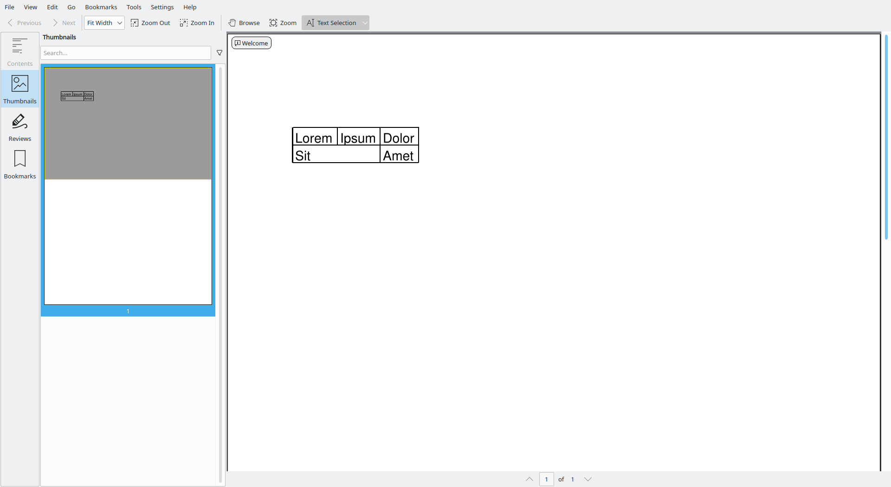

Of course, you can do the same for `row_span`:

```python
#!src/snippet_018.py
```


<div style="page-break-before: always;"></div>

### 3.2.6 Using the `TableUtil` class

If you don't intend to change the default look&feel of your `Table` too much, `borb` comes with the convenience class `TableUtil`.
This class can convert a 2D array of `typing.Any` to a `Table`. This is a real time-saver if you simply want to dump some tabular data to a PDF.

In the following example, you'll use `TableUtil` to dump a 2D array to a PDF.

```python
#!src/snippet_019.py
```

This creates the following PDF:

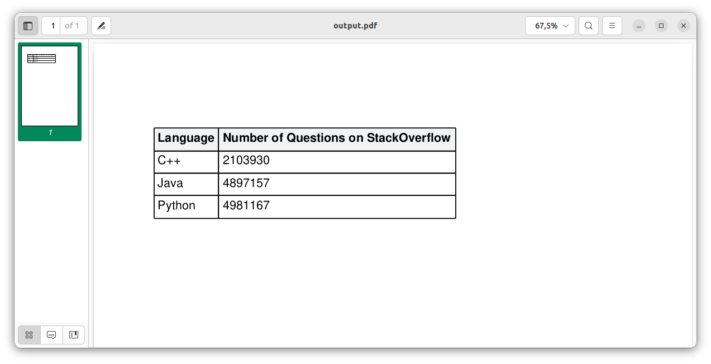

## 3.3 Nesting `Table` in `List` and vice-versa

### 3.3.1 Nesting a `Table` in a `List`

You can add a `Table` to a `List`, since `List` accepts any `LayoutElement` as content,
and `Table` implements the `LayoutElement` interface.

```python
#!src/snippet_020.py
```

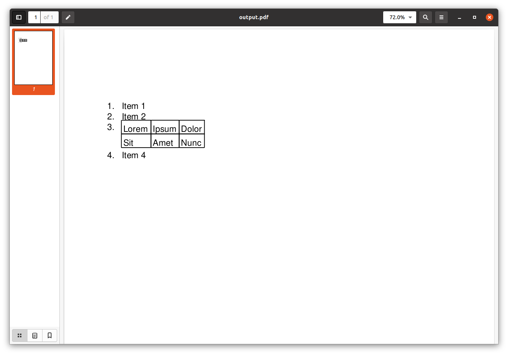

### 3.3.2 Nesting a `List` in a `Table`

Conversely, you can also use `List` inside a `Table`.

```python
#!src/snippet_021.py
```


## 3.4 Smart Art

A `SmartArt` `LayoutElement` is a striking visual representation of your data, process or workflow.
You can easily create them in `borb` using the `SmartArt` class, which defines several static methods to represent your information.

In this first example, we're going to display a process (represented as `typing.List[str]`) with some blocks and arrows.

```python
#!src/snippet_022.py
```

You can see that `borb` will automatically take care of things like  creating the underyling `Paragraph` objects,
arranging them (using a `Table`) and inserting `ConnectedShape` objects to represent the arrows between blocks.

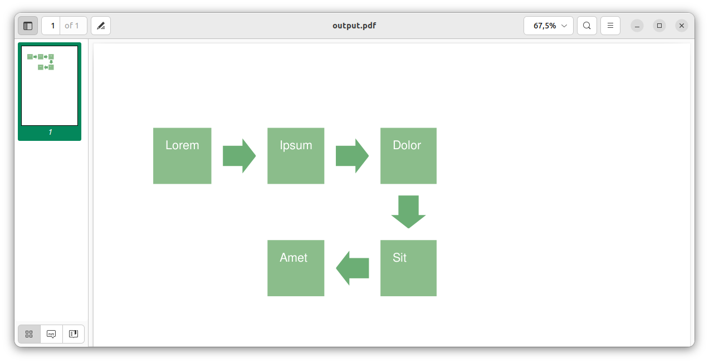

With `SmartArt` you can bring your ideas to life! You can of course configure the graphics by specifying:

- `font_size`
- `foreground_color` 
- `background_color`
- `font_color`

Although all these parameters are already filled in to sensible defaults. So you can leave them as-is if you prefer less configuration.

Let's look at another example. In this example we'll use `SmartArt` to display opposing ideas.
It really doesn't take much effort to code this up:

```python
#!src/snippet_023.py
```

And check out the wonderful result!

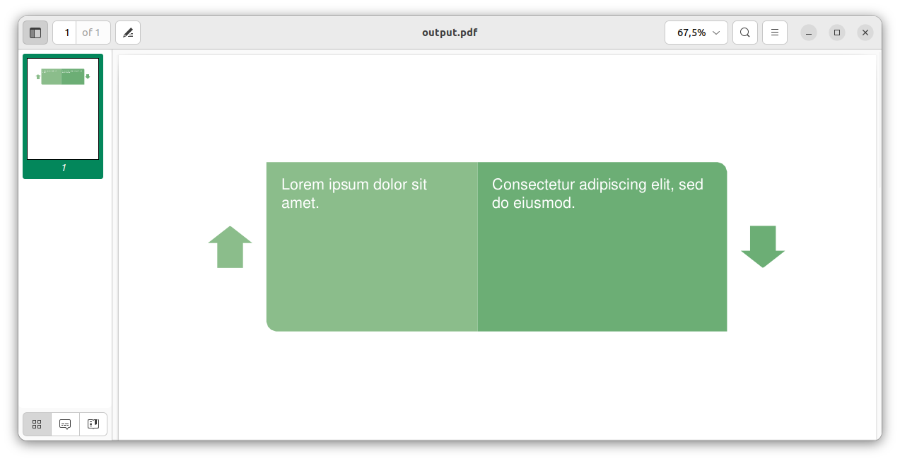

## 3.5 Conclusion

In this chapter you've learnt how to use the basic `LayoutElement` objects inside larger container-`LayoutElement` objects such as `Table` and `List`.
You've seen some pratical differences between the various implementations of `Table` and `List` and you've coded up some examples for each of them.

<div style="page-break-before: always;"></div>
