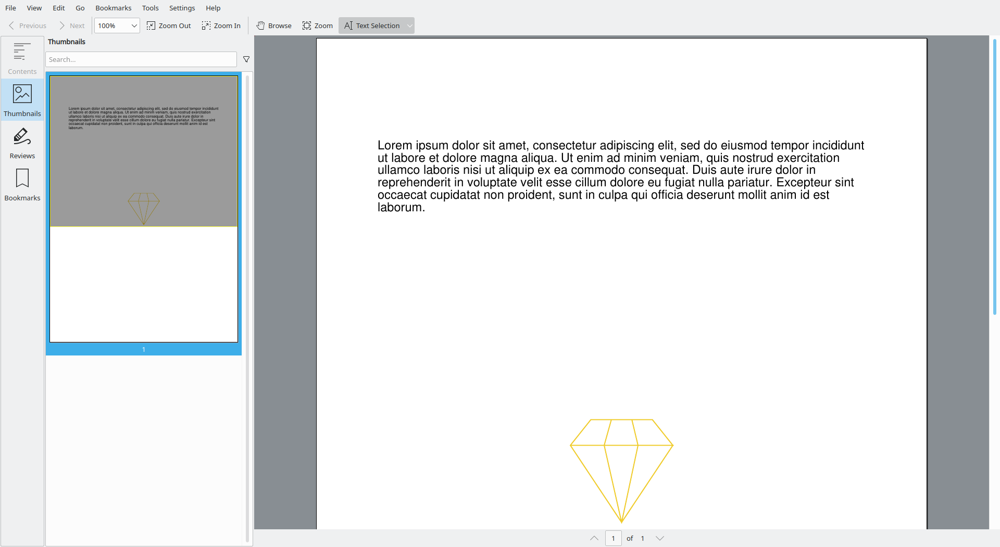
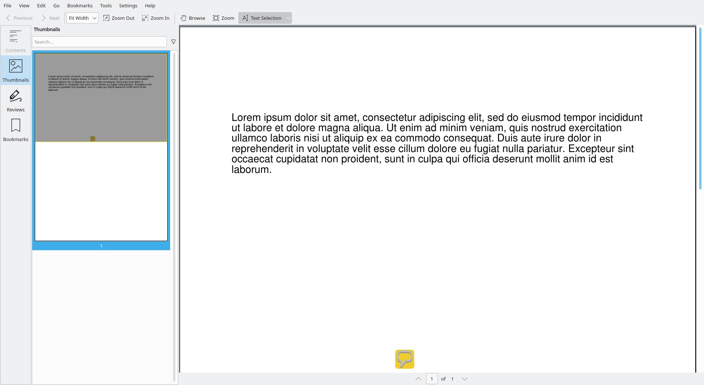
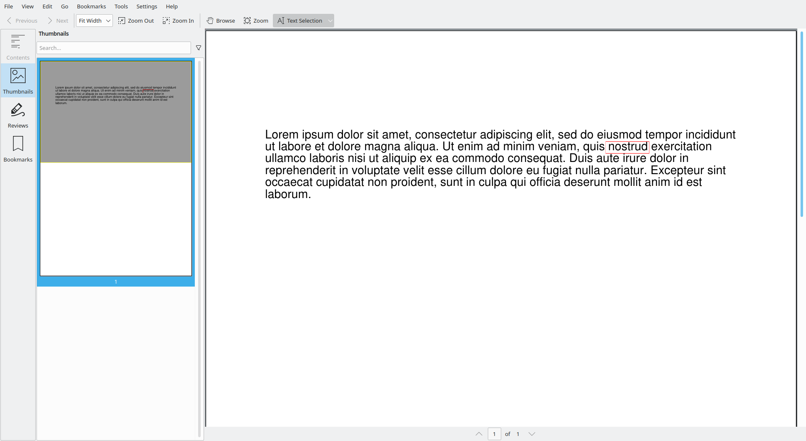

# 6 Adding annotations to a PDF

from the PDF-spec:

> An annotation associates an object such as a note, sound, or movie with a location on a page of a PDF
> document, or provides a way to interact with the user by means of the mouse and keyboard. PDF includes a
> wide variety of standard annotation types, described in detail in 12.5.6, “Annotation Types.”


<div style="page-break-before: always;"></div>

## 6.1 Adding geometric shapes

For this example, you'll be adding a cartoon-ish diamond shape to a PDF.
You can do this with a PDF that was just created, or with an existing PDF.
`borb` comes with a rich `LineArtFactory` enabling you to easily add a shape to your PDF without having to resort to pixel-geometry.

```python
#!src/snippet_001.py
```



You may be wondering why `borb` did not make it easier on you to add the annotation.
I mean to say, you had to calculate the coordinates yourself, that's unusually unhelpful.

The key thing to take away from this example (and in fact all subsequent examples in this section) is that annotations are typically added **after** the `Document` has been generated.

So `borb` does not offer much convenience methods, because it assumes the precise layout of the `Page` will have already been baked in to the `Document` at which point it is too late to attempt to retrieve it.

## 6.2 Adding text annotations

In this example you'll be creating a text-annotation. 
This is comparable to adding a pop-up Post-it note to a PDF.

```python
#!src/snippet_002.py
```

You can customize quite a few aspects of this particular annotation:

- The text
- The location at which the icon is displayed
- The icon being displayed (you have the option to select one from a range of pre-defined icons)
- The color of the icon (and the resulting pop-up box)

The PDF you created should end up looking like this:



And when you click on the icon in the middle of the page, you get a little pop-up:


## 6.3 Adding link annotations

Link annotations provide your readers with an easy way to navigate the PDF document.
Clicking a link-annotation can:

- Take the reader to a predefined page (or piece of a page)
- Set the zoom level at which the page is being displayed
- Set the crop box of the PDF reader

In the next example, you'll create a `Document` with several pages, 
and provide each of them with a convenient "back to the beginning" link annotation.

```python
#!src/snippet_003.py
```


Try it! Navigate to any `Page` of the `Document` and click the link-annotation. 
It should send you straight back to the first `Page`.

You used `DestinationType.FIT` in this example, which forces the viewer software to go to a given page (0 in this case),
and ensure the zoom-level is set to fit this page in the viewer. This is the option that requires the least amount of parameters.
You can  also set other `DestinationType` values, for instance to force the viewer to go to a particular y-coordinate of a given page, etc.

- `DestinationType.FIT` : Display the page designated by page, with its contents magnified just
enough to fit the entire page within the window both horizontally and
vertically. If the required horizontal and vertical magnification factors
are different, use the smaller of the two, centering the page within the
window in the other dimension.

- `DestinationType.FIT_B` : (PDF 1.1) Display the page designated by page, with its contents
magnified just enough to fit its bounding box entirely within the window
both horizontally and vertically. If the required horizontal and vertical
magnification factors are different, use the smaller of the two,
centering the bounding box within the window in the other dimension.

- `DestinationType.FIT_B_H` : (PDF 1.1) Display the page designated by page, with the vertical
coordinate top positioned at the top edge of the window and the
contents of the page magnified just enough to fit the entire width of its
bounding box within the window. A null value for top specifies that the
current value of that parameter shall be retained unchanged.

- `DestinationType.FIT_B_V` : (PDF 1.1) Display the page designated by page, with the horizontal
coordinate left positioned at the left edge of the window and the
contents of the page magnified just enough to fit the entire height of its
bounding box within the window. A null value for left specifies that the
current value of that parameter shall be retained unchanged.

- `DestinationType.FIT_H` : Display the page designated by page, with the vertical coordinate top
positioned at the top edge of the window and the contents of the page
magnified just enough to fit the entire width of the page within the
window. A null value for top specifies that the current value of that
parameter shall be retained unchanged.

- `DestinationType.FIT_R` : Display the page designated by page, with its contents magnified just
enough to fit the rectangle specified by the coordinates left, bottom,
right, and top entirely within the window both horizontally and vertically.
If the required horizontal and vertical magnification factors are
different, use the smaller of the two, centering the rectangle within the
window in the other dimension.

- `DestinationType.FIT_V` : Display the page designated by page, with the horizontal coordinate
left positioned at the left edge of the window and the contents of the
page magnified just enough to fit the entire height of the page within
the window. A null value for left specifies that the current value of that
parameter shall be retained unchanged.

- `DestinationType.X_Y_Z` : Display the page designated by page, with the coordinates (left, top)
positioned at the upper-left corner of the window and the contents of
the page magnified by the factor zoom. A null value for any of the
parameters left, top, or zoom specifies that the current value of that
parameter shall be retained unchanged. A zoom value of 0 has the
same meaning as a null value.

This example is very minimalistic. You can expand upon it.
Rather than using a simple square, you can draw an `Image` or `Paragraph` and have the annotation be on top of it.
I'm just giving you the basic tools you need, what you do with them is limited only by your imagination.

## 6.4 Adding remote go-to annotations

A remote go-to annotation allows you to make an area of your PDF clickable and functions like a hyperlink when clicked.
This can be particularly useful if your PDF is part of a document-process where you might want to link this document to its source-system, or other documents.

```python
#!src/snippet_004.py
```


## 6.5 Adding rubber stamp annotations

Rubber stamp annotations bring a bit of that classic paper feeling to digital documents.
A giant "Confidential" on a page just screams "classy".

In the next example, you'll be adding a rubber stamp annotation to a simple "lorem ipsum" document.

```python
#!src/snippet_005.py
```


The different types of rubber stamps are limited (the PDF spec only defines a handful of them);

- `RubberStampAnnotationIconType.APPROVED`
- `RubberStampAnnotationIconType.AS_IS`
- `RubberStampAnnotationIconType.CONFIDENTIAL`
- `RubberStampAnnotationIconType.DRAFT`
- `RubberStampAnnotationIconType.EXPERIMENTAL`
- `RubberStampAnnotationIconType.EXPIRED`
- `RubberStampAnnotationIconType.FINAL`
- `RubberStampAnnotationIconType.FOR_COMMENT`
- `RubberStampAnnotationIconType.FOR_PUBLIC_RELEASE`
- `RubberStampAnnotationIconType.NOT_APPROVED`
- `RubberStampAnnotationIconType.NOT_FOR_PUBLIC_RELEASE`
- `RubberStampAnnotationIconType.SOLD`
- `RubberStampAnnotationIconType.TOP_SECRET`

And the rendering of the stamp is entirely up to the reader software. 
So this example may look entirely different on your device.

<div style="page-break-before: always;"></div>

## 6.6 Adding redaction (annotations)

from the PDF spec:
> A redaction annotation (PDF 1.7) identifies content that is intended to be removed from the document. The
> intent of redaction annotations is to enable the following process:
>
> a) Content identification. A user applies redact annotations that specify the pieces or regions of content that
> should be removed. Up until the next step is performed, the user can see, move and redefine these
> annotations.
>
> b) Content removal. The user instructs the viewer application to apply the redact annotations, after which the
> content in the area specified by the redact annotations is removed. In the removed content’s place, some
> marking appears to indicate the area has been redacted. Also, the redact annotations are removed from
> the PDF document.
>
> Redaction annotations provide a mechanism for the first step in the redaction process (content identification).
> This allows content to be marked for redaction in a non-destructive way, thus enabling a review process for
> evaluating potential redactions prior to removing the specified content.
> Redaction annotations shall provide enough information to be used in the second phase of the redaction
> process (content removal). This phase is application-specific and requires the conforming reader to remove all
> content identified by the redaction annotation, as well as the annotation itself.

### 6.6.1 Adding redaction annotations

In the next example, you'll be adding a redaction annotation. In a subsequent example you'll be using `borb` to apply all redaction annotations (thus removing the content).
Redaction annotations are simply another kind of annotation, so all the methods and tools you've seen so far can of course be used again.

```python
#!src/snippet_006.py
```



Of course, rather than passing a `Rectangle`, you can also use some of the logic you've applied in previous examples. 
For instance, you can use `RegularExpressionTextExtraction` to look for a regular expression and then redact it.
This is particularly useful if you're trying to remove structured information such as:

- A bank account number
- A social security number
- A phone number
- An email address
- Etc

`borb` comes with a small library of useful (common) regular expressions.
These can be found in `CommonRegularExpression`;

- `BITCOIN_ADDRESS`
- `CREDIT_CARD`
- `DATE`
- `DOLLAR_PRICE`
- `EMAIL`
- `HEX_COLOR`
- `IPV4`
- `IPV6`
- `PHONE`
- `PHONE_WITH_EXTENSION`
- `PO_BOX`
- `ROMAN_NUMERAL`
- `SOCIAL_SECURITY_NUMBER`
- `STREET_ADDRESS`
- `TIME`
- `URL`
- `ZIP_CODE`

The document you produced should still have the "marked for redaction" - content.
You could (at this point) ask a PDF reader (e.g. "Adobe") to apply the redaction annotations.
Although this feature may not be supported.

> :warning: If you are using `RegularExpressionTextExtraction` to mark content for redaction
> keep in mind that it might be trivially simple to retrieve said content if you remove/mark
> the exact boundaries of the matching text.
> 
> Put simply, if you are removing the word "Greece" from a PDF, and an attacker knows that the removed
> word needs to be a country, they can simply check the width of every known country in the `font` and `font_size`
> used in your PDF. This narrows down the list very quickly.
> I would advise you to always add some random padding.
> 
> You can do this by calling the `grow` method on the `Rectangle` objects returned
> by `RegularExpressionTextExtraction`.

### 6.6.2 Applying redaction annotations

In this example you'll be applying the redaction annotations you added to the `Document` earlier.

```python
#!src/snippet_007.py
```


If you now try to select the content in the `Document`, you'll see the text is gone.

<div style="page-break-before: always;"></div>

## 6.7 Adding invisible `JavaScript` buttons

This annotation requires some trickiness. You're going to add a regular `RemoteGoToAnnotation` and modify its `Action` dictionary to have the `Annotation` perform like a click-button.
You're going to add some `JavaScript` to the button's onclick.

```python
#!src/snippet_008.py
```


## 6.8 Adding sound annotations

Did you know you can add sound to a PDF?
This opens all kinds of options; you could add a text-to-speech rendering of your PDF to the document itself.
Talk about making your PDF accessible!

In this example we're going to add a `SoundAnnotation` to a PDF, which plays some classical music.

```python
#!src/snippet_009.py
```


## 6.9 Conclusion

In this section you've learned how to work with `Annotation` objects.
These objects allow you to add content to existing PDF documents.

<div style="page-break-before: always;"></div>
