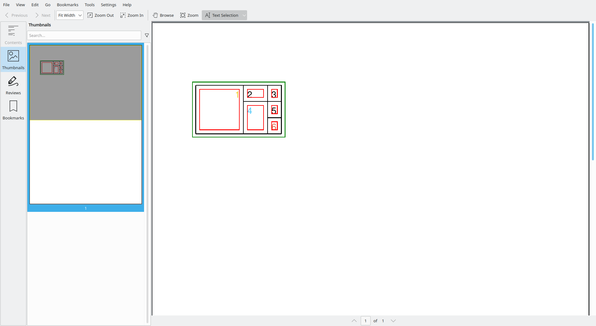
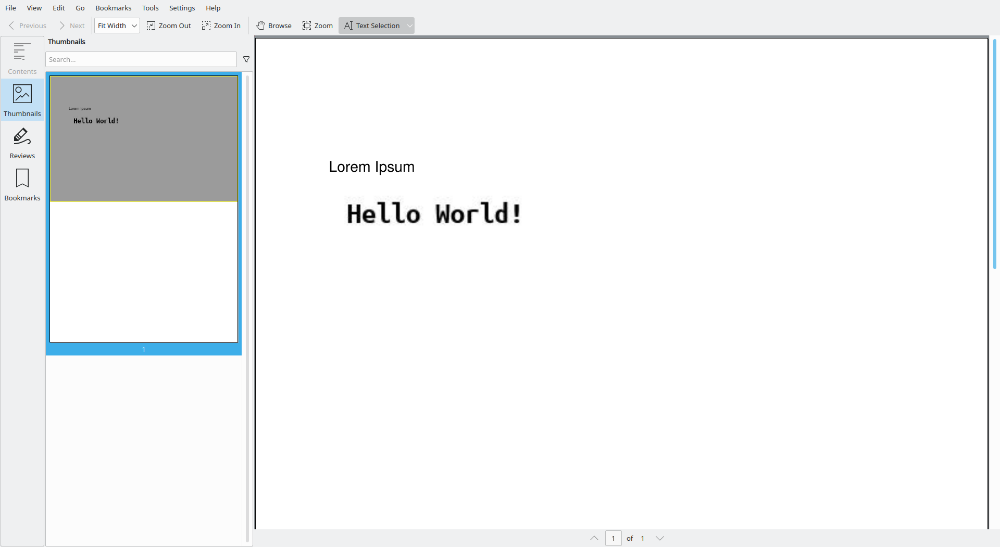

# 7 Heuristics for PDF documents

Most of what you've done so far is exact.
There is an exact algorithm for retrieving the bytes of an embedded file.
There are algorithms for retrieving text that have been proven to work (for many years, in many libraries).

This section deals with some of the more "guesswork"-based algorithms for PDF.

One of these (and perhaps the most useful even) is extracting structured content: tables.

In this section you'll learn how to:

- Extract tables from a PDF
- Apply OCR to a PDF (and extracting text from the subsequent `Document`)
- Export a PDF to various image formats
- Export certain formats (HTML, Markdown) to PDF


<div style="page-break-before: always;"></div>

## 7.1 Extracting tables from a PDF

For the next example you'll first need to create a `Document` with a `Table`.
In order to provide `borb` with a challenge, let's create a `Table` with:

- `row_span`
- `col_span`
- `font_color`
- `text_alignment`

```python
#!src/snippet_001
```

This creates a PDF that looks like this:


Now you can use the `TableDetectionByLines` implementation of `EventListener` to get the job done.

In this example, you'll be adding rectangular annotations to display the detected `Table` and `TableCell` objects.
This is something I do a lot, adding annotations is a quick and easy way to debug a PDF workflow.

```python
#!src/snippet_002.py
```



As you can see, `borb` was able to find the `Table` and retrieve its `TableCell` objects.
Now that you have their coordinates, you can easily use some of the earlier examples (filtering text by location for instance) to retrieve the contents of each cell.

<div style="page-break-before: always;"></div>

## 7.2 Performing OCR on a PDF

This is by far one of the most classic questions on any programming-forum, or helpdesk: "My document does not seem to have text in it. Help?" or "Your text-extraction code sample does not work for my document. How come?"

The answer is often as straightforward as "your scanner hates you".

Most of the documents for which this doesn't work are PDF documents that are essentially glorified images.
They contain all the meta-data needed to constitute a PDF, but their pages are just large (often low-quality) images.

As a consequence, there are no text-rendering instructions in these documents. 
And most PDF libraries will not be able to handle them.

`borb` however is different, `borb` just loves to help.

In this section you'll be using a special `EventListener` implementation called `OCRAsOptionalContentGroup`.
This class uses `tesseract` (or rather `pytesseract`) to perform OCR (optical character recognition) on the `Document`.

Once finished, the recognized text is re-inserted in each `Page` as a special "layer" (in PDF this is called an "optional content group").

With the content now restored, the usual tricks (`SimpleTextExtraction`) yield the expected results.


You'll start by creating a method that builds a PIL `Image` with some text in it.
This `Image` will then be inserted in a PDF.

```python
#!src/snippet_003.py
```

Now you can build a `Document` with this `Image`

```python
#!src/snippet_004.py
```

The document should look something like this:



When you select the text in this document, you'll see immediately that only the top line is actually text.
The rest is an `Image` with text (the `Image` you created).


Now you can apply OCR to this `Document`:

```python
#!src/snippet_005.py
```


You can see this created an extra layer in the PDF.
This layer is named "OCR by borb", and contains the rendering instructions `borb` re-inserted in the `Document`.

You can toggle the visibility of this layer (this can be handy when debugging).


You can see `borb` re-inserted the postscript rendering command to ensure "Hello World!" is in the `Document.
Let's hide this layer again.

Now (even with the layer hidden), you can select the text:


And if you apply `SimpleTextExtraction` now, you should be able to retrieve all the text in the `Document`.

```python
#!src/snippet_006.py
```

This prints:

```
Lorem Ipsum
Hello World!
```

<div style="page-break-before: always;"></div>

## 7.3 Exporting PDF as a (PIL) image

Let's start by creating a PDF we can later export.
In the next example you'll be creating a PDF with different fonts, font-sizes and an image.

```python
#!src/snippet_007.py
```


Now let's export this as an Image.

```python
#!src/snippet_008.py
```


<div style="page-break-before: always;"></div>

## 7.4 Exporting PDF as an SVG image

```python
#!src/snippet_009.py
```


<div style="page-break-before: always;"></div>

## 7.5 Exporting Markdown as PDF

Markdown is a very convenient format (for developers and non-technical people) to provide a quick and legible lightweight formatted document.

You'll be using the following input markdown:

> \# Headings  
> To create a heading, add number signs (#) in front of a word or phrase. The number of number signs you use should correspond to the heading level. For example, to create a heading level three (\<h3\>), use three number signs (e.g., ### My Header).
>  
> \# Heading level 1  
> \#\# Heading level 2  
> \#\#\# Heading level 3  
> \#\#\#\# Heading level 4  
> \#\#\#\#\# Heading level 5  
> \#\#\#\#\#\# Heading level 6  
>
> \#\# Alternate Syntax
> Alternatively, on the line below the text, add any number of == characters for heading level 1 or -- characters for heading level 2.
>
> Heading level 1  
> \===============
>
> Heading level 2  
> \---------------
>
> \#\# Heading Best Practices  
> Markdown applications don’t agree on how to handle a missing space between the number signs (#) and the heading name. For compatibility, always put a space between the number signs and the heading name.
>
> You should also put blank lines before and after a heading for compatibility.

Using `borb`, you can transform Markdown to PDF;

```python
#!src/snippet_010.py
```

This produces the following PDF;


<div style="page-break-before: always;"></div>

## 7.6 Exporting HTML as PDF

Another wonderful format for content is HTML. 
`borb` supports basic HTML to PDF conversion. 
Keep an eye out for this functionality in the future, as new features, tags and support will be added gradually.

For this example, you'll be using the following HTML snippet:

> \<html>  
>   \<head>  
>       \<title>Lorem Ipsum\</title>  
>   \</head>  
>       \<p>  
>            Hello World!  
>       \</p>  
>    \</html>

```python
#!src/snippet_011.py
```

Which ends up producing the following PDF:


You'll also notice (if you open this PDF in your preferred viewer) that the title of the `Document` was set to `"lorem ipsum"`.
So `borb` also processed the meta-information.

Check out the examples in the GitHub repository and the tests to find out more supported `HTML`.

<div style="page-break-before: always;"></div>

## 7.7 Conclusion

In this chapter you've learned some of the more advanced ways of working with `borb` and PDF in general.
You've learnt how to convert various formats to PDF, and back again. You've applied OCR, and extracted tables.
The examples in this chapter may not be for everyone, but you will undoubtedly gain a deeper understanding of `borb` and PDF by studying the code.

<div style="page-break-before: always;"></div>
